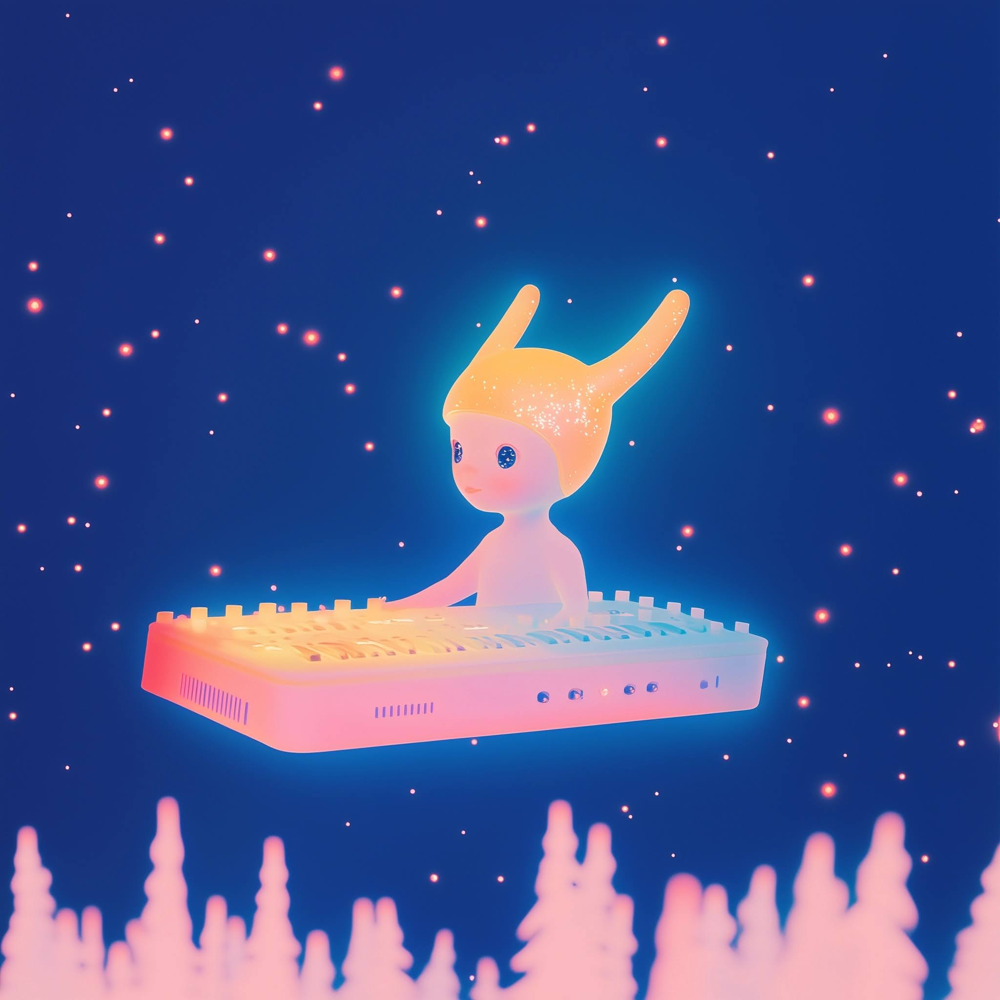

- Trying some sora prompts for a ghost in the patch video
	- {:height 778, :width 770}
	-
	- Nyxis the Harmonic Starling came to the Guild of the Ghostpatch in the The Glen of Resonant Whispers from another planet. They are fused with a starsynth hovercraft that they drive around the glen during ceremonies. Nyxis's antennae pick up the sounds of the stars, and as they circle around the glen, light thickens in a trail behind them, descending on the trees below like long strands of glowing hot toffee.