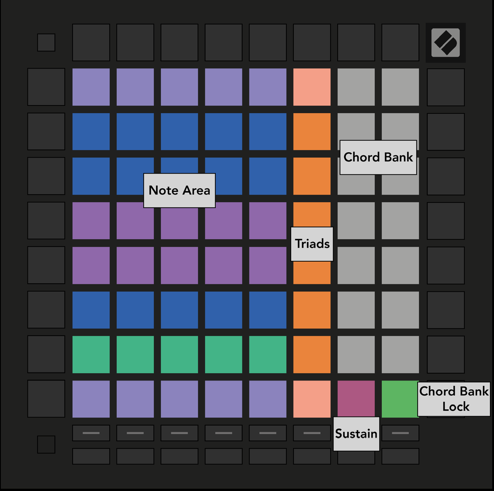

public:: true
logseq-entity:: [[Logseq/Entity/Book/Section/Level 2]], [[Logseq/Entity/Proxy/Page]]
up:: [[Launchpad/UG/07 Chord Mode]]
next:: [[Launchpad/UG/07 Chord Mode/02 Triads]]
logseq-proxy-url:: logseq://graph/logseq-encode-garden?page=Launchpad%2FUG%2F07%20Chord%20Mode%2F01%20Overview
logseq-proxy-codeforge-url:: https://github.com/codekiln/logseq-encode-garden/blob/codex%2F202-proxy-task-import-docs/pages/Launchpad___UG___07%20Chord%20Mode___01%20Overview.md
logseq-proxy-last-sync-date:: [[2026-10-08]]

- # 7.1 Overview
	- The Chord layout divides the grid into a Note Area, an orange triad column, and a white Chord Bank. Sustain and Chord Bank Lock sit along the lower edge.
	- 7.1.A — Chord Mode layout
		- 