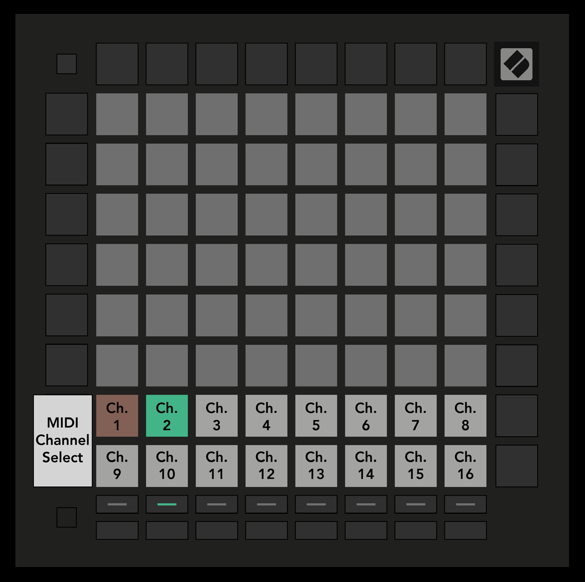

public:: true
logseq-entity:: [[Logseq/Entity/Book/Section/Level 2]], [[Logseq/Entity/Proxy/Page]]
up:: [[Launchpad/UG/08 Custom Modes]]
prev:: [[Launchpad/UG/08 Custom Modes/02 Default Custom Modes]]
next:: [[Launchpad/UG/08 Custom Modes/04 Set Up a Custom Mode]]
logseq-proxy-url:: logseq://graph/logseq-encode-garden?page=Launchpad%2FUG%2F08%20Custom%20Modes%2F03%20Master%20MIDI%20Channel
logseq-proxy-codeforge-url:: https://github.com/codekiln/logseq-encode-garden/blob/codex%2F202-proxy-task-import-docs/pages/Launchpad___UG___08%20Custom%20Modes___03%20Master%20MIDI%20Channel.md
logseq-proxy-last-sync-date:: [[2026-10-08]]

- # 8.3 Custom Mode Master MIDI Channel
	- Hold Shift and press Custom. The bottom two rows show MIDI channels 1–16 for the selected mode. Each Custom Mode has its own Master Channel.
	- Select a mode with Track Select, then press its desired channel pad. The active mode and its channel glow green; channels stored for inactive modes show dim red.
	- 8.3.A — Selecting a Custom Mode Master Channel
		- 