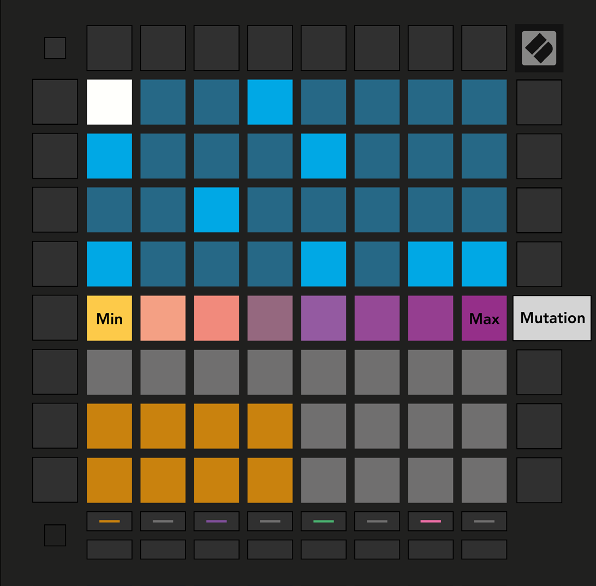

public:: true
logseq-entity:: [[Logseq/Entity/Book/Section/Level 3]], [[Logseq/Entity/Proxy/Page]]
up:: [[Launchpad/UG/09 Sequencer/08 Mutation]]
next:: [[Launchpad/UG/09 Sequencer/08 Mutation/02 Print]]
logseq-proxy-url:: logseq://graph/logseq-encode-garden?page=Launchpad%2FUG%2F09%20Sequencer%2F08%20Mutation%2F01%20Edit
logseq-proxy-codeforge-url:: https://github.com/codekiln/logseq-encode-garden/blob/codex%2F202-proxy-task-import-docs/pages/Launchpad___UG___09%20Sequencer___08%20Mutation___01%20Edit.md
logseq-proxy-last-sync-date:: [[2026-10-08]]

- # 9.8.1 Editing Step Mutation
	- Press Mutation and select a step in the top half of the grid. The top row of the Play Area shows an eight-pad Mutation slider for that step.
	- The leftmost value means no Mutation; the rightmost is the maximum. Newly recorded or assigned steps begin with no Mutation (one pad lit).
	- Mutation view
		- 