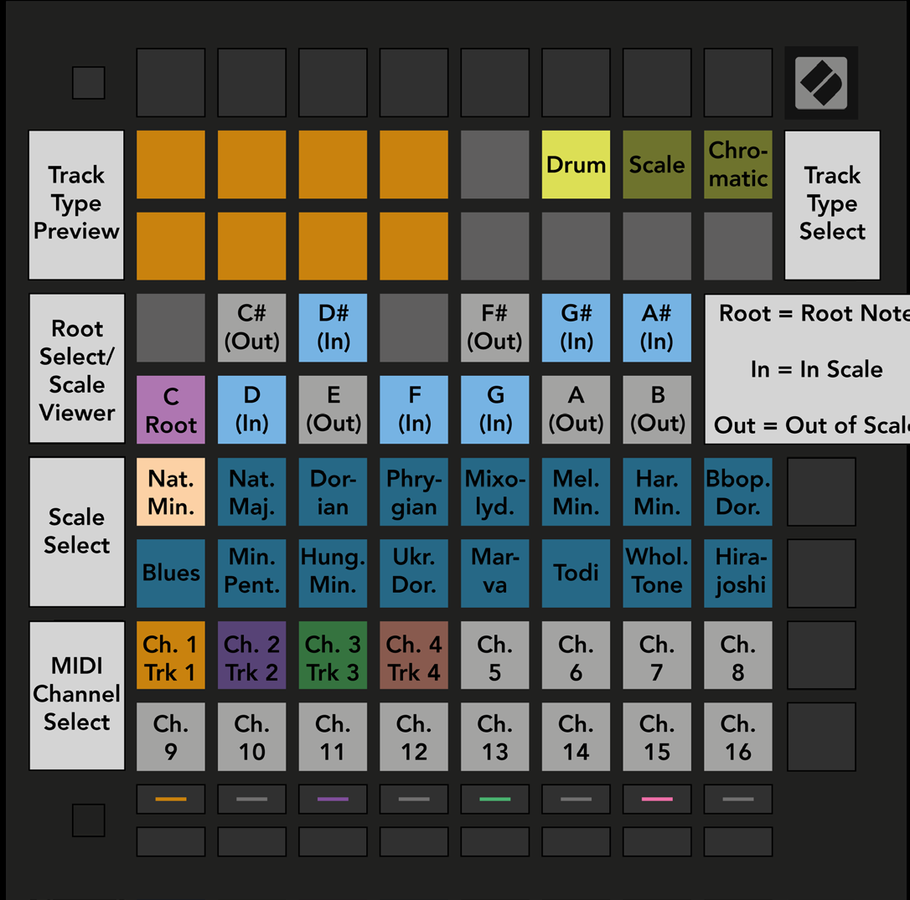

public:: true
logseq-entity:: [[Logseq/Entity/Book/Section/Level 3]], [[Logseq/Entity/Proxy/Page]]
up:: [[Launchpad/UG/09 Sequencer/13 Settings]]
next:: [[Launchpad/UG/09 Sequencer/13 Settings/02 Track Types]]
logseq-proxy-url:: logseq://graph/logseq-encode-garden?page=Launchpad%2FUG%2F09%20Sequencer%2F13%20Settings%2F01%20Access
logseq-proxy-codeforge-url:: https://github.com/codekiln/logseq-encode-garden/blob/codex%2F202-proxy-task-import-docs/pages/Launchpad___UG___09%20Sequencer___13%20Settings___01%20Access.md
logseq-proxy-last-sync-date:: [[2026-10-08]]

- # 9.13.1 Accessing Sequencer Settings
	- Hold Shift and press Sequencer to open Sequencer Settings.
	- Sequencer Settings view
		- 