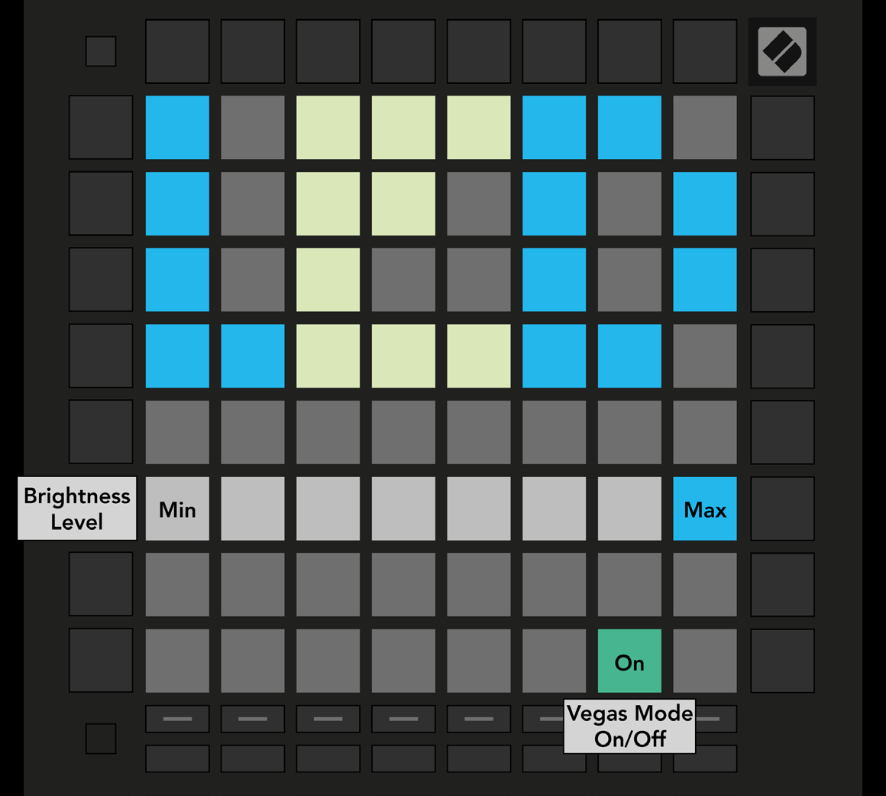

public:: true
logseq-entity:: [[Logseq/Entity/Book/Section/Level 2]], [[Logseq/Entity/Proxy/Page]]
up:: [[Launchpad/UG/10 Setup]]
prev:: [[Launchpad/UG/10 Setup/01 Setup Menu]]
next:: [[Launchpad/UG/10 Setup/03 Velocity Settings]]
logseq-proxy-url:: logseq://graph/logseq-encode-garden?page=Launchpad%2FUG%2F10%20Setup%2F02%20LED%20Settings
logseq-proxy-codeforge-url:: https://github.com/codekiln/logseq-encode-garden/blob/codex%2F202-proxy-task-import-docs/pages/Launchpad___UG___10%20Setup___02%20LED%20Settings.md
logseq-proxy-last-sync-date:: [[2026-10-08]]

- # 10.2 LED Settings
	- Press the first Track Select button. Choose among eight brightness levels; the bright white pad marks the active level.
	- Vegas Mode starts after five minutes without activity. Its toggle is green when enabled and red when disabled.
	- 10.2.A — LED Settings view
		- 