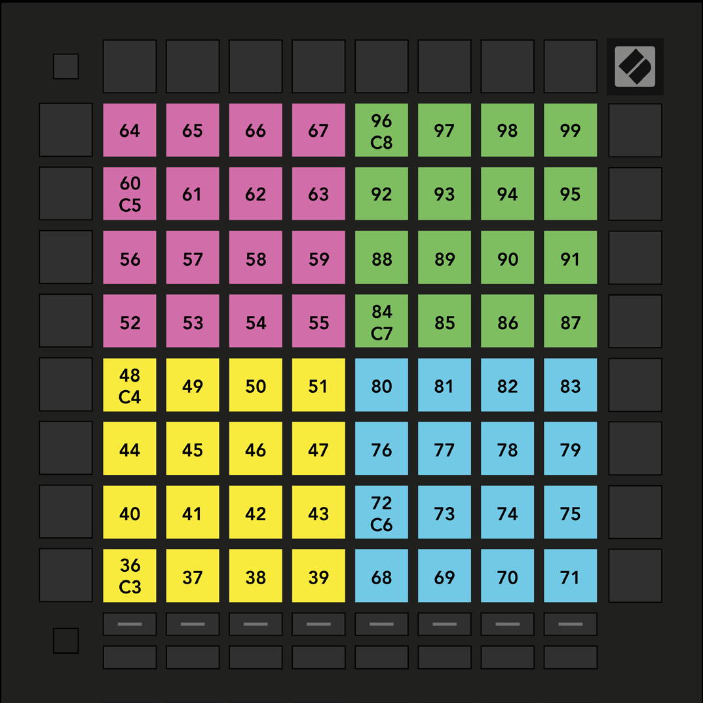

public:: true
logseq-entity:: [[Logseq/Entity/Book/Section/Level 3]], [[Logseq/Entity/Proxy/Page]]
up:: [[Launchpad/UG/11 Appendix/01 Default MIDI Mappings]]
prev:: [[Launchpad/UG/11 Appendix/01 Default MIDI Mappings/02 Custom 2]]
next:: [[Launchpad/UG/11 Appendix/01 Default MIDI Mappings/04 Custom 4]]
logseq-proxy-url:: logseq://graph/logseq-encode-garden?page=Launchpad%2FUG%2F11%20Appendix%2F01%20Default%20MIDI%20Mappings%2F03%20Custom%203
logseq-proxy-codeforge-url:: https://github.com/codekiln/logseq-encode-garden/blob/codex%2F202-proxy-task-import-docs/pages/Launchpad___UG___11%20Appendix___01%20Default%20MIDI%20Mappings___03%20Custom%203.md
logseq-proxy-last-sync-date:: [[2026-10-08]]

- # A.1.3 Custom 3
	- The 8 × 8 grid sends momentary notes in four 4 × 4 drum areas.
	- A.1.3 — Custom 3 default mapping
		- 