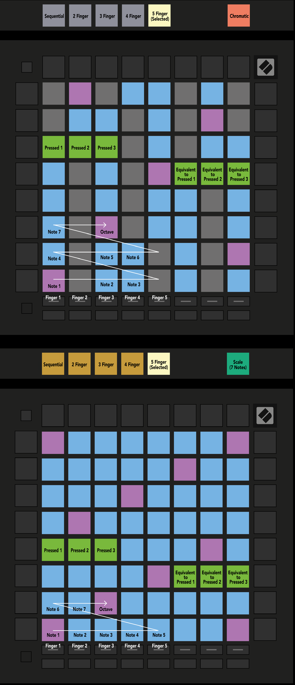

public:: true
logseq-entity:: [[Logseq/Entity/Book/Section/Level 3]], [[Logseq/Entity/Proxy/Page]]
up:: [[Launchpad/UG/11 Appendix/02 Overlap Layouts]]
next:: [[Launchpad/UG/11 Appendix/02 Overlap Layouts/02 Four Finger]]
logseq-proxy-url:: logseq://graph/logseq-encode-garden?page=Launchpad%2FUG%2F11%20Appendix%2F02%20Overlap%20Layouts%2F01%20Five%20Finger
logseq-proxy-codeforge-url:: https://github.com/codekiln/logseq-encode-garden/blob/codex%2F202-proxy-task-import-docs/pages/Launchpad___UG___11%20Appendix___02%20Overlap%20Layouts___01%20Five%20Finger.md
logseq-proxy-last-sync-date:: [[2026-10-08]]

- # A.2.1 Overlap – Five Finger
	- Five-finger overlap repeats the leftmost notes of an upper row toward the right of the row below.
	- A.2.1 — Five Finger overlap in Chromatic and Scale Modes
		- 