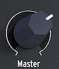

public:: true
logseq-entity:: [[Logseq/Entity/Book/Section/Level 4]], [[Logseq/Entity/Proxy/Page]]
up:: [[Microfreak/UG/03 Overview/01 Front Panel/01 Top Row]]
prev:: [[Microfreak/UG/03 Overview/01 Front Panel/01 Top Row/06 Utility]]
logseq-proxy-url:: logseq://graph/logseq-encode-garden?page=Microfreak%2FUG%2F03%20Overview%2F01%20Front%20Panel%2F01%20Top%20Row%2F07%20Master%20Volume
logseq-proxy-codeforge-url:: https://github.com/codekiln/logseq-encode-garden/blob/codex%2F202-proxy-task-import-docs/pages/Microfreak___UG___03%20Overview___01%20Front%20Panel___01%20Top%20Row___07%20Master%20Volume.md
logseq-proxy-last-sync-date:: [[2026-10-08]]
- # 03.01.01.07 Master Volume
	- **Master Volume** sets the global output level for both the line and headphone outputs. To balance one preset against another, set `Utility > Preset > Preset volume`.
	- The Volume knob
		- 
