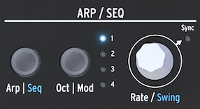

public:: true
logseq-entity:: [[Logseq/Entity/Book/Section/Level 4]], [[Logseq/Entity/Proxy/Page]]
up:: [[Microfreak/UG/03 Overview/01 Front Panel/03 Bottom Row]]
prev:: [[Microfreak/UG/03 Overview/01 Front Panel/03 Bottom Row/02 Shift]]
next:: [[Microfreak/UG/03 Overview/01 Front Panel/03 Bottom Row/04 LFO]]
logseq-proxy-url:: logseq://graph/logseq-encode-garden?page=Microfreak%2FUG%2F03%20Overview%2F01%20Front%20Panel%2F03%20Bottom%20Row%2F03%20Arp%20Seq
logseq-proxy-codeforge-url:: https://github.com/codekiln/logseq-encode-garden/blob/codex%2F202-proxy-task-import-docs/pages/Microfreak___UG___03%20Overview___01%20Front%20Panel___03%20Bottom%20Row___03%20Arp%20Seq.md
logseq-proxy-last-sync-date:: [[2026-10-08]]
- # 03.01.03.03 ARP/Seq (Arpeggiator/Sequencer)
	- The Arpeggiator plays notes derived from the held keys. [[Microfreak/UG/12 Arpeggiator]] and [[Microfreak/UG/13 Sequencer]] share several controls.
	- The Arpeggiator and the Sequencers
		- 
	- **Arp | Seq** switches between the Arpeggiator and Sequencer. **Oct | Mod** sets the Arpeggiator range or selects one of four Sequencer modulation tracks.
	- **Rate** sets the tempo in BPM. Press the knob to enable Sync; with Sync active, the knob changes the time division relative to the set tempo.
