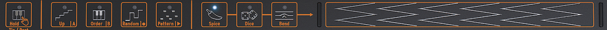
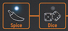

public:: true
logseq-entity:: [[Logseq/Entity/Book/Section/Level 4]], [[Logseq/Entity/Proxy/Page]]
up:: [[Microfreak/UG/03 Overview/01 Front Panel/03 Bottom Row]]
prev:: [[Microfreak/UG/03 Overview/01 Front Panel/03 Bottom Row/06 Keyboard]]
logseq-proxy-url:: logseq://graph/logseq-encode-garden?page=Microfreak%2FUG%2F03%20Overview%2F01%20Front%20Panel%2F03%20Bottom%20Row%2F07%20Icon%20Strip
logseq-proxy-codeforge-url:: https://github.com/codekiln/logseq-encode-garden/blob/codex%2F202-proxy-task-import-docs/pages/Microfreak___UG___03%20Overview___01%20Front%20Panel___03%20Bottom%20Row___07%20Icon%20Strip.md
logseq-proxy-last-sync-date:: [[2026-10-08]]
- # 03.01.03.07 The Icon strip
	- The eight icons above the keyboard provide Arpeggiator, Pattern Generator, Sequencer, Spice, Dice, and Bend controls.
	- The icon strip
		- 
	- **Spice** and **Dice** vary the current arpeggio or sequence; their effects are audible only while the Arpeggiator or Sequencer runs. Dice changes gates and triggers, while Spice sets the amount of variation.
	- Spice & Dice
		- 
	- [[Microfreak/UG/10 Keyboard]] explains the Icon strip in detail.
