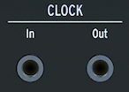

public:: true
logseq-entity:: [[Logseq/Entity/Book/Section/Level 3]], [[Logseq/Entity/Proxy/Page]]
up:: [[Microfreak/UG/03 Overview/02 Rear Panel]]
prev:: [[Microfreak/UG/03 Overview/02 Rear Panel/02 Pitch Gate Pressure]]
next:: [[Microfreak/UG/03 Overview/02 Rear Panel/04 MIDI]]
logseq-proxy-url:: logseq://graph/logseq-encode-garden?page=Microfreak%2FUG%2F03%20Overview%2F02%20Rear%20Panel%2F03%20Clock
logseq-proxy-codeforge-url:: https://github.com/codekiln/logseq-encode-garden/blob/codex%2F202-proxy-task-import-docs/pages/Microfreak___UG___03%20Overview___02%20Rear%20Panel___03%20Clock.md
logseq-proxy-last-sync-date:: [[2026-10-08]]
- # 03.02.03 Clock input/output
	- Sync the MicroFreak with external synthesizers or modular systems through the Clock input and output.
	- Clock input and output
		- 
	- > [[Note/Info]] A TRS jack carries both clock and start signals. A TS jack carries only clock.
