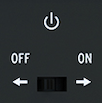

public:: true
logseq-entity:: [[Logseq/Entity/Book/Section/Level 3]], [[Logseq/Entity/Proxy/Page]]
up:: [[Microfreak/UG/03 Overview/02 Rear Panel]]
prev:: [[Microfreak/UG/03 Overview/02 Rear Panel/05 USB DC In]]
next:: [[Microfreak/UG/03 Overview/02 Rear Panel/07 Power Connector]]
logseq-proxy-url:: logseq://graph/logseq-encode-garden?page=Microfreak%2FUG%2F03%20Overview%2F02%20Rear%20Panel%2F06%20Power%20Switch
logseq-proxy-codeforge-url:: https://github.com/codekiln/logseq-encode-garden/blob/codex%2F202-proxy-task-import-docs/pages/Microfreak___UG___03%20Overview___02%20Rear%20Panel___06%20Power%20Switch.md
logseq-proxy-last-sync-date:: [[2026-10-08]]
- # 03.02.06 Power switch
	- The recessed switch turns the MicroFreak off without unplugging USB. When both USB and DC power are connected, DC power takes priority; connecting DC power resets the MicroFreak.
	- The On-Off switch
		- 
	- > [[Note/Info]] The MicroFreak can run from a phone or tablet power bank.
