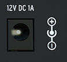

public:: true
logseq-entity:: [[Logseq/Entity/Book/Section/Level 3]], [[Logseq/Entity/Proxy/Page]]
up:: [[Microfreak/UG/03 Overview/02 Rear Panel]]
prev:: [[Microfreak/UG/03 Overview/02 Rear Panel/06 Power Switch]]
logseq-proxy-url:: logseq://graph/logseq-encode-garden?page=Microfreak%2FUG%2F03%20Overview%2F02%20Rear%20Panel%2F07%20Power%20Connector
logseq-proxy-codeforge-url:: https://github.com/codekiln/logseq-encode-garden/blob/codex%2F202-proxy-task-import-docs/pages/Microfreak___UG___03%20Overview___02%20Rear%20Panel___07%20Power%20Connector.md
logseq-proxy-last-sync-date:: [[2026-10-08]]
- # 03.02.07 Power Connector
	- Connect the supplied Arturia power supply to the mains outlet. The supply provides the ground required by the capacitive keyboard.
	- The power connector
		- 
