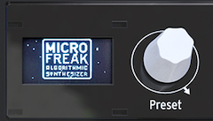

public:: true
logseq-entity:: [[Logseq/Entity/Book/Section/Level 2]], [[Logseq/Entity/Proxy/Page]]
up:: [[Microfreak/UG/04 Presets]]
next:: [[Microfreak/UG/04 Presets/02 Save Presets]]
logseq-proxy-url:: logseq://graph/logseq-encode-garden?page=Microfreak%2FUG%2F04%20Presets%2F01%20Load%20Presets
logseq-proxy-codeforge-url:: https://github.com/codekiln/logseq-encode-garden/blob/codex%2F202-proxy-task-import-docs/pages/Microfreak___UG___04%20Presets___01%20Load%20Presets.md
logseq-proxy-last-sync-date:: [[2026-10-08]]
- # 04.01 Loading Presets
	- Turn the Preset encoder to load a preset. The first 128 slots contain factory presets. If you want to keep those intact while learning synthesis, use slots 129–512 for your sounds.
	- Presets in slots 129–512 are templates for building sounds in specific categories. A preset you like can also serve as a template for further exploration.
	- Tweak the loaded preset, then save it if you want to keep your changes.
	- > [[Note/Warning]] By default, loading another preset clears unsaved changes without warning. Turn on Utility > Global > Controls > Click to Load to browse without replacing the current sound; click the encoder to save the current changes and load the selected preset.
	- Press the Preset encoder quickly three times to reset the current sound to its initial empty state. This also clears an existing preset's sound.
	- > [[Note/Info]] The reset does not change the stored preset unless you save afterward.
	- The Preset encoder
		- 
