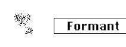

public:: true
logseq-entity:: [[Logseq/Entity/Book/Section/Level 3]], [[Logseq/Entity/Proxy/Page]]
up:: [[Microfreak/UG/06 Dig Osc/03 Types]]
prev:: [[Microfreak/UG/06 Dig Osc/03 Types/08 Two Op.FM]]
next:: [[Microfreak/UG/06 Dig Osc/03 Types/10 Chords]]
logseq-proxy-url:: logseq://graph/logseq-encode-garden?page=Microfreak%2FUG%2F06%20Dig%20Osc%2F03%20Types%2F09%20Formant
logseq-proxy-codeforge-url:: https://github.com/codekiln/logseq-encode-garden/blob/codex%2F202-proxy-task-import-docs/pages/Microfreak___UG___06%20Dig%20Osc___03%20Types___09%20Formant.md
logseq-proxy-last-sync-date:: [[2026-10-08]]
- # 06.03.09 Granular formant oscillator (Formant)
	- Granular formant Oscillator Model
		- 
	- **Description:** Granular synthesis chops a wave into tiny pieces called particles, then rearranges, multiplies, and combines them. This model rearranges particles into formants and filtered waveforms.
	- **Interval:** Sets the frequency ratio between formants one and two.
	- **Formant:** Sets the formant frequency.
	- **Shape:** Sets formant width and shape by controlling the window applied to the sum of two synchronized sine oscillators.
