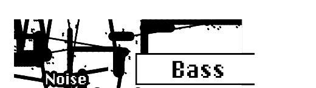

public:: true
logseq-entity:: [[Logseq/Entity/Book/Section/Level 3]], [[Logseq/Entity/Proxy/Page]]
up:: [[Microfreak/UG/06 Dig Osc/03 Types]]
prev:: [[Microfreak/UG/06 Dig Osc/03 Types/13 Noise]]
next:: [[Microfreak/UG/06 Dig Osc/03 Types/15 SAWX]]
logseq-proxy-url:: logseq://graph/logseq-encode-garden?page=Microfreak%2FUG%2F06%20Dig%20Osc%2F03%20Types%2F14%20BASS
logseq-proxy-codeforge-url:: https://github.com/codekiln/logseq-encode-garden/blob/codex%2F202-proxy-task-import-docs/pages/Microfreak___UG___06%20Dig%20Osc___03%20Types___14%20BASS.md
logseq-proxy-last-sync-date:: [[2026-10-08]]
- # 06.03.14 BASS Oscillator (Bass)
	- BASS Oscillator Model
		- 
	- **Description:** The BASS model is a quadrature oscillator with Sine and Cosine inputs. The Sine oscillator feeds a balanced modulator, and its output mixes with the modulated Cosine oscillator. Saturate, Fold, and Noise control the modulation model.
	- **Saturate:** Sets the saturation of the Cosine oscillator.
	- **Fold:** Applies a two-stage asymmetric fold that adds harmonics by folding parts of the wave that fall outside set boundaries back onto the wave. Don Buchla pioneered wavefolding in the early 1970s.
	- **Noise:** Sets the noise level. Noise phase-modulates the two oscillators in opposite phases and is added between the fold stages.
