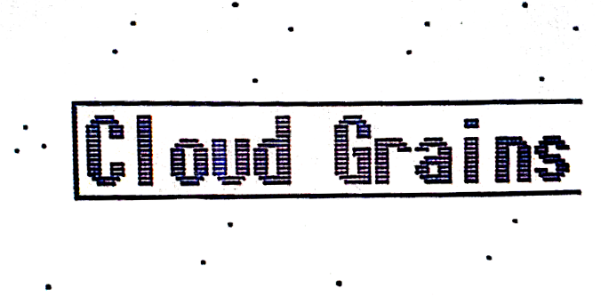

public:: true
logseq-entity:: [[Logseq/Entity/Book/Section/Level 3]], [[Logseq/Entity/Proxy/Page]]
up:: [[Microfreak/UG/06 Dig Osc/03 Types]]
prev:: [[Microfreak/UG/06 Dig Osc/03 Types/19 Scan Grains]]
next:: [[Microfreak/UG/06 Dig Osc/03 Types/21 Hit Grains]]
logseq-proxy-url:: logseq://graph/logseq-encode-garden?page=Microfreak%2FUG%2F06%20Dig%20Osc%2F03%20Types%2F20%20Cloud%20Grains
logseq-proxy-codeforge-url:: https://github.com/codekiln/logseq-encode-garden/blob/codex%2F202-proxy-task-import-docs/pages/Microfreak___UG___06%20Dig%20Osc___03%20Types___20%20Cloud%20Grains.md
logseq-proxy-last-sync-date:: [[2026-10-08]]
- # 06.03.20 Cloud grains
	- Cloud grains oscillator model
		- 
	- The Cloud grains oscillator plays a loaded sample with control over its start point and grain generation.
	- **Starts:** The Wave knob sets the grain start position.
	- **Density:** The Timbre knob sets how often a grain is generated.
	- **Chaos:** The Shape knob adds randomness to density, size, pitch, and other parameters.
	- Sample browsing and parameter adjustment work like the [[Microfreak/UG/06 Dig Osc/03 Types/18 Sample]].
