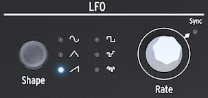

public:: true
logseq-entity:: [[Logseq/Entity/Book/Section/Level 1]], [[Logseq/Entity/Proxy/Page]]
up:: [[Microfreak/UG]]
prev:: [[Microfreak/UG/07 Filter]]
next:: [[Microfreak/UG/09 Envelope Gen]]
logseq-proxy-url:: logseq://graph/logseq-encode-garden?page=Microfreak%2FUG%2F08%20LFO
logseq-proxy-codeforge-url:: https://github.com/codekiln/logseq-encode-garden/blob/codex%2F202-proxy-task-import-docs/pages/Microfreak___UG___08%20LFO.md
logseq-proxy-last-sync-date:: [[2026-10-08]]

- # 08 The LFO
	- An LFO (short for low-frequency oscillator) produces waveforms at sub-audio frequencies. These waveforms can modulate other parts of the MicroFreak, such as:
		- The oscillator pitch
		- The filter cutoff frequency
		- The filter emphasis
		- The stages of an envelope
	- A familiar use for LFO modulation is a filter sweep: the LFO waveform moves the cutoff point of a low-pass filter over time.
	- The MicroFreak LFO
		- 
	- Try the triangle and rising sawtooth waves to hear how the sweep changes shape. The rectangle wave cycles between low and high states, making it useful for toggling an oscillator between two pitches. Depending on the Matrix modulation amount, the pitch can jump by two or four scale steps, or by a full octave.
	- {{embed [[Microfreak/UG/08 LFO/01 LFO Shape]]}}
	- {{embed [[Microfreak/UG/08 LFO/02 LFO Rate]]}}
	- {{embed [[Microfreak/UG/08 LFO/03 Freaky Tips]]}}
