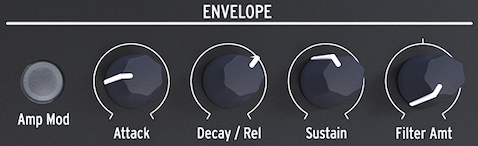

public:: true
logseq-entity:: [[Logseq/Entity/Book/Section/Level 1]], [[Logseq/Entity/Proxy/Page]]
up:: [[Microfreak/UG]]
prev:: [[Microfreak/UG/08 LFO]]
next:: [[Microfreak/UG/10 Keyboard]]
logseq-proxy-url:: logseq://graph/logseq-encode-garden?page=Microfreak%2FUG%2F09%20Envelope%20Gen
logseq-proxy-codeforge-url:: https://github.com/codekiln/logseq-encode-garden/blob/codex%2F202-proxy-task-import-docs/pages/Microfreak___UG___09%20Envelope%20Gen.md
logseq-proxy-last-sync-date:: [[2026-10-08]]
- # 09 The Envelope Generator
	- The Envelope Generator is one of the MicroFreak's basic building blocks. It shapes a sound's overall loudness or timbre and can send modulation to any Matrix destination, including destinations you create.
	- The Envelope Generator
		- 
	- {{embed [[Microfreak/UG/09 Envelope Gen/01 What an Envelope Does]]}}
	- {{embed [[Microfreak/UG/09 Envelope Gen/02 Gates and Triggers]]}}
	- {{embed [[Microfreak/UG/09 Envelope Gen/03 Envelope Stages]]}}
	- {{embed [[Microfreak/UG/09 Envelope Gen/04 Filter Amount]]}}
	- {{embed [[Microfreak/UG/09 Envelope Gen/05 Amp Mod Button]]}}
	- {{embed [[Microfreak/UG/09 Envelope Gen/06 Cycling Envelope]]}}
	- {{embed [[Microfreak/UG/09 Envelope Gen/07 Cycling Envelope Suggestions]]}}
