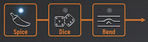

public:: true
logseq-entity:: [[Logseq/Entity/Book/Section/Level 2]], [[Logseq/Entity/Proxy/Page]]
up:: [[Microfreak/UG/11 Icon Strip]]
prev:: [[Microfreak/UG/11 Icon Strip/02 Sequencer and Arpeggiator]]
logseq-proxy-url:: logseq://graph/logseq-encode-garden?page=Microfreak%2FUG%2F11%20Icon%20Strip%2F03%20Touch%20Strip
logseq-proxy-codeforge-url:: https://github.com/codekiln/logseq-encode-garden/blob/codex%2F202-proxy-task-import-docs/pages/Microfreak___UG___11%20Icon%20Strip___03%20Touch%20Strip.md
logseq-proxy-last-sync-date:: [[2026-10-08]]
- # 11.3 The Touch Strip
	- The touch strip has three functions. Select Spice, Dice, or Bend by pressing its corresponding icon.
	- Spice and Dice and Bend
		- 
	- {{embed [[Microfreak/UG/11 Icon Strip/03 Touch Strip/01 Spice and Dice]]}}
	- {{embed [[Microfreak/UG/11 Icon Strip/03 Touch Strip/02 Bend]]}}
