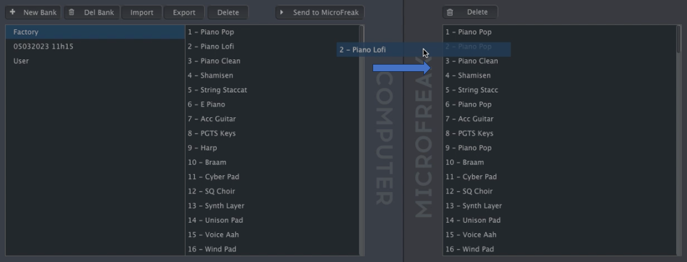

public:: true
logseq-entity:: [[Logseq/Entity/Book/Section/Level 4]], [[Logseq/Entity/Proxy/Page]]
up:: [[Microfreak/UG/14 Config/02 MIDI Control Center/03 Samples Tab]]
prev:: [[Microfreak/UG/14 Config/02 MIDI Control Center/03 Samples Tab/01 Management]]
next:: [[Microfreak/UG/14 Config/02 MIDI Control Center/03 Samples Tab/03 Deleting]]
logseq-proxy-url:: logseq://graph/logseq-encode-garden?page=Microfreak%2FUG%2F14%20Config%2F02%20MIDI%20Control%20Center%2F03%20Samples%20Tab%2F02%20Dragging
logseq-proxy-codeforge-url:: https://github.com/codekiln/logseq-encode-garden/blob/codex%2F202-proxy-task-import-docs/pages/Microfreak___UG___14%20Config___02%20MIDI%20Control%20Center___03%20Samples%20Tab___02%20Dragging.md
logseq-proxy-last-sync-date:: [[2026-10-08]]
- # 14.2.3.2 More on Dragging and Dropping
	- Drag individual samples between the computer and MicroFreak in either direction. The destination slot highlights blue when you hover over it; releasing the sample there overwrites that slot.
	- Dragging a sample between computer and MicroFreak
		- 
	- Drag samples within either pane to change their order. In the computer pane, drag a sample name over another bank's name to move it into that bank.
	- Shift-click or Command-click to select several samples before dragging them together.
