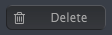
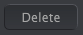

public:: true
logseq-entity:: [[Logseq/Entity/Book/Section/Level 4]], [[Logseq/Entity/Proxy/Page]]
up:: [[Microfreak/UG/14 Config/02 MIDI Control Center/03 Samples Tab]]
prev:: [[Microfreak/UG/14 Config/02 MIDI Control Center/03 Samples Tab/02 Dragging]]
logseq-proxy-url:: logseq://graph/logseq-encode-garden?page=Microfreak%2FUG%2F14%20Config%2F02%20MIDI%20Control%20Center%2F03%20Samples%20Tab%2F03%20Deleting
logseq-proxy-codeforge-url:: https://github.com/codekiln/logseq-encode-garden/blob/codex%2F202-proxy-task-import-docs/pages/Microfreak___UG___14%20Config___02%20MIDI%20Control%20Center___03%20Samples%20Tab___03%20Deleting.md
logseq-proxy-last-sync-date:: [[2026-10-08]]
- # 14.2.3.3 Deleting Samples
	- Delete button in the computer pane
		- 
	- Delete button in the MicroFreak pane
		- 
	- Select a sample and use a Delete button at the top of the Samples tab or the keyboard's Delete key.
	- > [[Note/Info]] Factory samples cannot be deleted.
